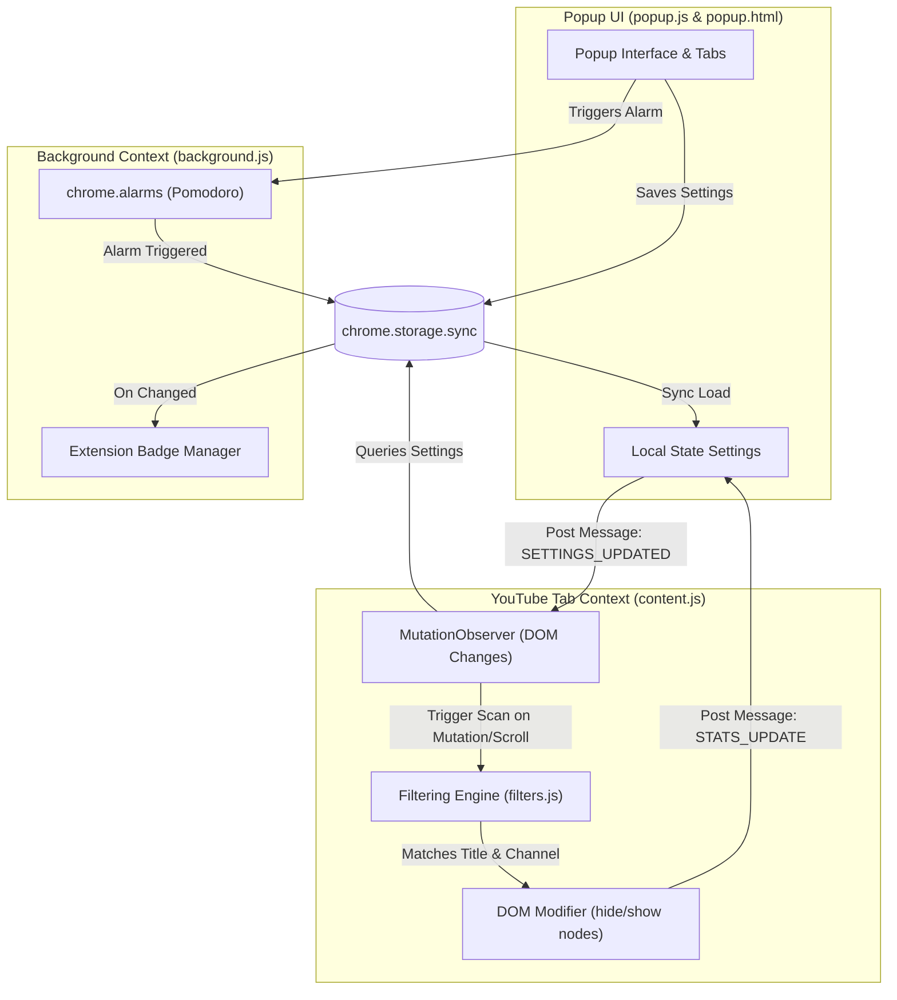

# TubeFocus 🎯 — Distraction-Free YouTube Study & Productivity Platform

[](https://chrome.google.com/webstore)
[](https://developer.chrome.com/docs/extensions/mv3/intro/)
[](LICENSE)

**TubeFocus** is a lightweight, high-performance browser extension designed to transform YouTube into a distraction-free study and productivity workspace. By executing real-time category filtering, blocking Shorts, and incorporating a native Pomodoro focus timer, TubeFocus filters out clickbait and recommendation loops so you can focus on academic, professional, and educational development.

---

## 🚀 Key Features

### 1. Smart Content Filtering Engine
*   **Category-Based Filtering:** Enable or disable pre-configured study fields (e.g., *Education*, *Programming*, *AI & ML*, *JEE/NEET*, *UPSC/IAS*, *Science*, *Mathematics*, *Productivity*).
*   **Custom Category Creator:** Create your own categories with personalized keyword triggers to customize your feed.
*   **Dynamic Keyword Editor:** Fine-tune allowed keywords within any category, adding or removing triggers on the fly.
*   **Custom Keyword Overrides:** Add individual global whitelist keywords to bypass category filters.
*   **Strict Mode:** Activate strict mode to auto-block known blacklisted patterns (e.g., pranks, daily vlogs, gameplay walkthroughs, gaming streams, gossip, clickbait).
*   **Channel Whitelist:** Input channel names to always display their content, regardless of general title checks.

### 2. Distraction-Free Layout Adjustments
*   **Shorts Blocker:** Removes all YouTube Shorts cards, shelves on the homepage, search results containing Shorts, the left sidebar "Shorts" navigation entry, and the "Shorts" filter chips.
*   **Homepage & Sidebar Cleanup:** Scans homepage grid nodes and watch-next recommendation sidebars to filter out unrelated content.

### 3. Integrated Pomodoro Focus Timer
*   **Background Alarm System:** Powered by `chrome.alarms` to persist countdown sessions even if the popup is closed.
*   **Flexible Time Settings:** Select from quick presets (25m, 45m, 60m, 90m) or modify minutes incrementally with an intuitive increment/decrement UI and custom input.
*   **Visual Ring Indicator:** Displays a progress ring that updates dynamically as the timer runs.

### 4. Advanced Statistics Dashboard
*   **Focus Score:** A real-time percentage representing the ratio of educational/relevant videos versus total elements scanned.
*   **Historical Counters:** Tracks total videos hidden, completed focus sessions, daily usage streak, and total focus minutes logged.

### 5. Premium UI/UX Design
*   **Theme Switcher:** Seamless toggle between an Outfit-inspired Dark Mode (glassmorphism, vibrant gradients) and a clean Light Mode.
*   **Micro-Animations:** Hover transitions, active state highlights, and toggle effects.

---

## 🏗️ System Architecture & Data Flow

TubeFocus utilizes a modular, message-driven architecture to coordinate state between the interactive Popup UI, the Background Worker, and the content script running inside the YouTube page context.



### Script Directory & Responsibilities
*   **`manifest.json`**: Extension configuration, declaring permissions (`storage`, `activeTab`, `alarms`), host matching patterns for YouTube, and register actions/scripts.
*   **`background.js`**: Background service worker managing the Pomodoro alarm clock, background badges (`ON`/`OFF`), and updating statistics when a Pomodoro timer successfully completes.
*   **`content.js`**: Content script injected into YouTube pages. Utilizes a debounced `MutationObserver` and throttled window scroll listener to watch for dynamically loaded video containers and apply filters.
*   **`filters.js`**: Pure functional filtering engine containing default category keyword lists, strict mode blacklists, container CSS selectors, and the logic to evaluate whether a video title or channel matches whitelist rules.
*   **`utils/helpers.js`**: Shared utility module housing performance helpers (debounce, throttle), text normalizers, string matches, ID generators, and default settings templates.
*   **`popup.html` & `popup.css`**: The structural markup and premium CSS rules formatting the extension popup layout, dashboard cards, grid groups, and Pomodoro progress circle.
*   **`popup.js`**: Popup controller handling user clicks, custom keyword inputs, category modifications, tab switching, and synchronization with stored configurations.

---

## 🛠️ Technology Stack
*   **Core Logic:** Vanilla JavaScript (ES6+ Modules & IIFE namespaces)
*   **Layout & Styling:** Semantic HTML5, CSS Variables, Flexbox, CSS Grid, custom CSS Animations (no framework dependencies)
*   **Typography:** [Google Fonts (Inter)](https://fonts.google.com/specimen/Inter)
*   **Extension Framework:** Manifest V3 API (Chrome, Edge, Brave, Opera)
*   **Performance Engineering:** Debouncing (150ms delay for DOM updates) and throttling (500ms limit for scrolls) to maintain 60 FPS on complex YouTube DOM pages.

---

## 📥 Installation (Developer Mode)

To run the TubeFocus extension locally for testing or development:

1.  **Clone or Download this repository:**
    ```bash
    git clone https://github.com/YourUsername/TubeFocus.git
    ```
2.  **Open Chrome Extensions Page:**
    Open your browser and navigate to `chrome://extensions/` (or click `Menu -> Extensions -> Manage Extensions`).
3.  **Enable Developer Mode:**
    Toggle the **Developer mode** switch in the top-right corner of the page.
4.  **Load Unpacked Extension:**
    Click the **Load unpacked** button in the top-left corner.
5.  **Select Directory:**
    Select the folder containing the repository files (ensure `manifest.json` is at the root of the chosen folder).
6.  **Verify & Pin:**
    The extension will load immediately. Click the puzzle icon in your Chrome toolbar and pin **TubeFocus** for quick access.

---

## 📖 Usage Guide

> [!NOTE]
> Ensure the master toggle in the top-right corner of the popup is turned **ON** to enable the filters. YouTube pages must be reloaded after initial installation.

1.  **Enabling Categories:** Open the popup, navigate to the **Categories** tab, and toggle the switch on any desired subject (e.g., *Programming*).
2.  **Modifying Keyword Lists:** Click on the category card header (or the chevron icon) to expand the details. Here, you can review current keywords, add new keywords (comma-separated), or delete existing ones.
3.  **Creating Custom Categories:** Type a name in the *Create new category* input at the top of the Categories tab and click **Add**. Customize its keyword list by expanding the card.
4.  **Managing Custom Keywords & Channels:** Under the **Settings** tab, add specific terms you want to always bypass (e.g., "blockchain") or whitelist channels (e.g., "3Blue1Brown") to skip keyword parsing entirely.
5.  **Starting a Pomodoro Session:** Select the **Timer** tab. Set your target duration (using the presets or adjustment buttons) and click **Start Focus**. A status badge `ON` will appear on the extension icon. When complete, your focus stats will automatically increment.
